# RouteSecHub — RPKI & BGP Routing Security Research Portal 🛡️

<div align="center">
  <p>
    <a href="README.md">中文</a> •
    <a href="README_EN.md">English</a>
  </p>
</div>

<div align="center">

[](https://github.com/RouteSecHub/RouteSecHub/releases)
[](https://opensource.org/licenses/MIT)
[](https://react.dev/)
[](https://www.typescriptlang.org/)
[](https://vitejs.dev/)
[](https://tailwindcss.com/)
[](https://github.com/RouteSecHub/RouteSecHub/stargazers)
[](https://github.com/RouteSecHub/RouteSecHub/network/members)

</div>

**RouteSecHub** 是一个面向 RPKI 与 BGP 路由安全研究的一站式导航与研究工作台，帮助研究人员快速找到数据源、工具、论文、标准、经典事件和可复现实验路径。

> **RouteSecHub** is a practical research portal for RPKI and BGP routing security. It helps researchers quickly find tools, datasets, APIs, papers, RFCs, routing security incidents, and reproducible experiment workflows.

---

## 🌟 为什么选择 RouteSecHub？

在 RPKI 和 BGP 路由安全研究中，研究人员常常需要在多个网站之间来回跳转：RouteViews 下载数据、RIPE RIS 查看路由、CAIDA 分析 AS 关系、RIPEstat 查询 RPKI 状态…… 这些资源分散在互联网各处，效率极低。

**RouteSecHub** 将这些资源整合到一个平台，按**研究任务**而非简单堆链接的方式组织，让你专注于研究本身：

<div align="center">
  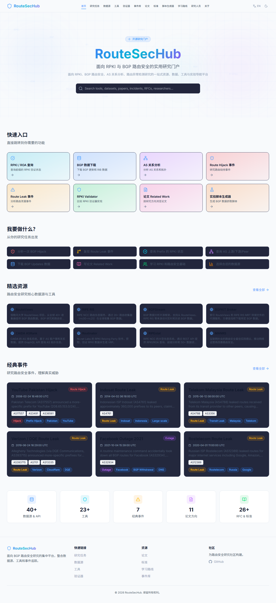
  <br/>
  <em>RouteSecHub 首页 — 一站式入口，快速定位你需要的资源</em>
</div>

---

## ✨ 核心特性

| 特性 | 说明 |
|:---|:---|
| 🎯 **任务驱动导航** | 按研究任务组织资源：分析 Hijack、查询 RPKI、下载数据、复现论文 |
| 📊 **46+ 数据源** | 涵盖 RouteViews、RIPE RIS、BGPStream、BGPKIT、CAIDA、RIPEstat 等 |
| 🔧 **22+ 工具** | RPKI Validator、BGPStream、BGPalerter、ARTEMIS、bgp.tools 等 |
| 📄 **25 篇论文** | 按 11 个研究方向组织的 Related Work 地图 |
| 📋 **26+ RFC/标准** | RPKI、ROA、ROV、BGPsec、ASPA 等 IETF 标准导航 |
| 🚨 **7 个经典事件** | YouTube Pakistan Hijack、Facebook Outage 2021 等，含时间线和分析步骤 |
| 🧪 **脚本生成器** | 一键生成 PyBGPStream / BGPKIT / wget 脚本，用于事件复现 |
| 📚 **7 级学习路线** | 从 BGP 基础到 ASPA/BGPsec 前沿，为新手设计 |
| 👥 **26 位研究人员** | RPKI/BGP 路由安全领域关键研究人员档案 |
| 🌐 **中英文切换** | 全站支持中文/英文切换 |
| ☀️/🌙 **亮/暗主题** | 支持明亮和暗色两种主题风格 |
| 🔍 **全局搜索** | 首页搜索框实时搜索所有资源、工具、论文、事件、研究人员 |

---

## 🎬 项目演示

### 主要功能界面

#### 🏠 首页 — 一站式入口
<div align="center">
  
  <br/>
  <em>快速入口、研究任务、精选资源、经典事件、统计信息</em>
</div>

#### 📊 数据源导航
<div align="center">
  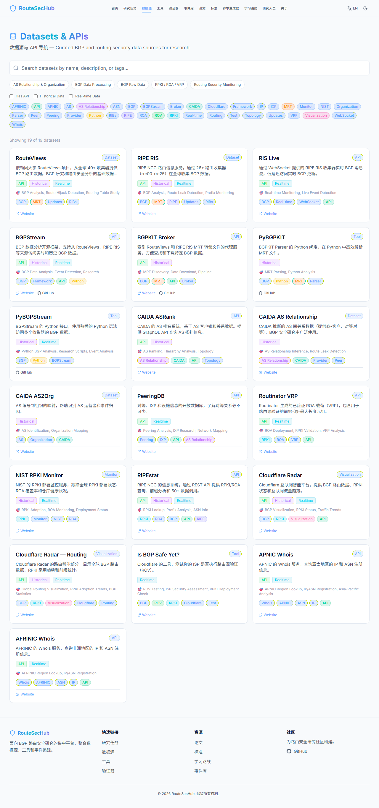
  <br/>
  <em>46+ 数据源，支持按类别、标签、API/历史/实时数据筛选</em>
</div>

#### 🔧 工具导航
<div align="center">
  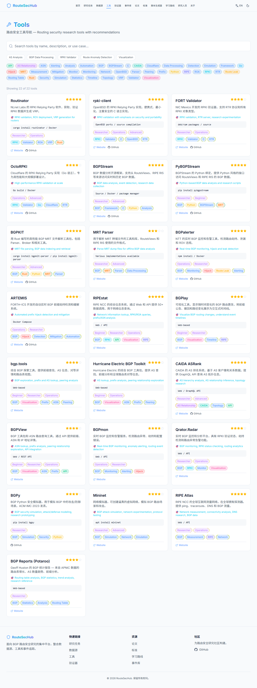
  <br/>
  <em>22+ 路由安全工具，含评分、适用人群、安装方式</em>
</div>

#### 🚨 路由安全事件库
<div align="center">
  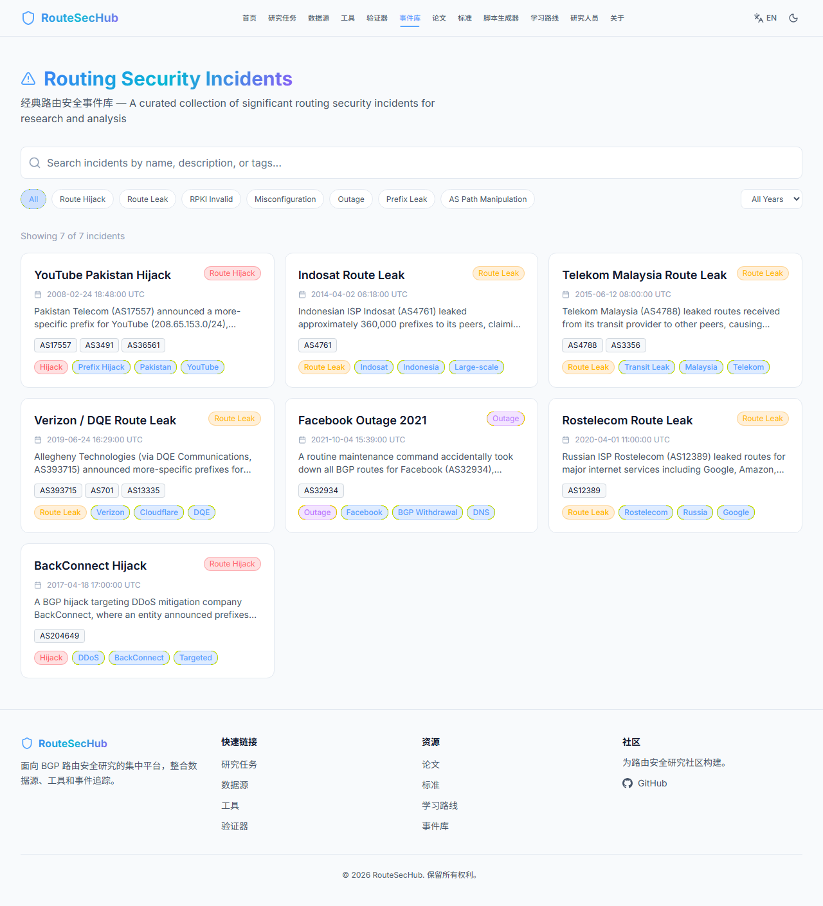
  <br/>
  <em>经典路由安全事件，支持按类型、年份筛选</em>
</div>

#### 🚨 事件详情
<div align="center">
  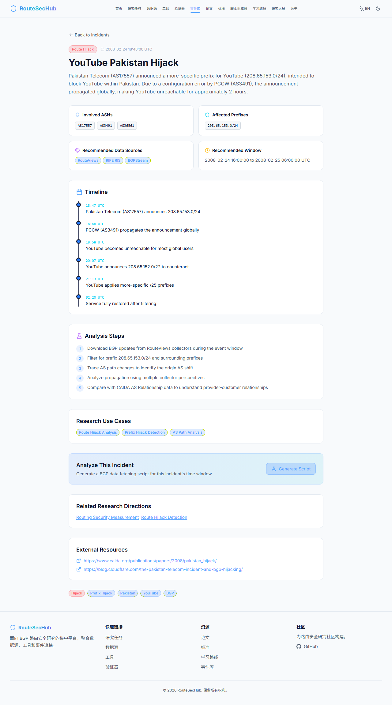
  <br/>
  <em>事件时间线、分析步骤、推荐数据源、一键生成脚本</em>
</div>

#### 🧪 实验脚本生成器
<div align="center">
  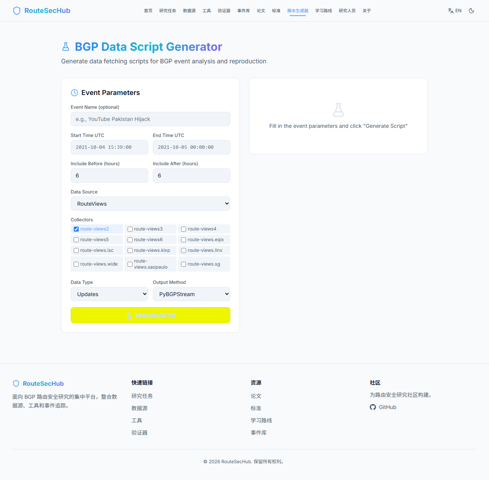
  <br/>
  <em>生成 PyBGPStream / BGPKIT / wget 脚本，支持从事件详情页跳转</em>
</div>

#### 📄 论文导航
<div align="center">
  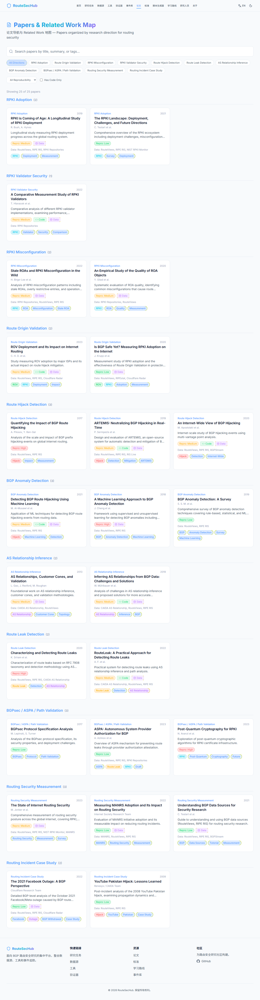
  <br/>
  <em>25 篇论文按 11 个研究方向组织，支持复现难度、代码筛选</em>
</div>

#### 📋 RFC / 标准导航
<div align="center">
  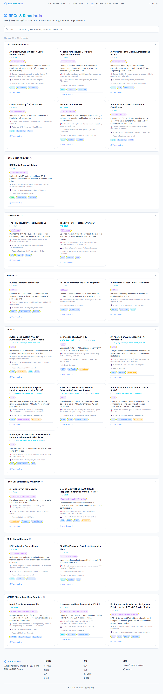
  <br/>
  <em>26+ IETF 标准，按 RPKI 基础、ROA、ROV、BGPsec、ASPA 等分类</em>
</div>

#### ✅ RPKI Validator 对比
<div align="center">
  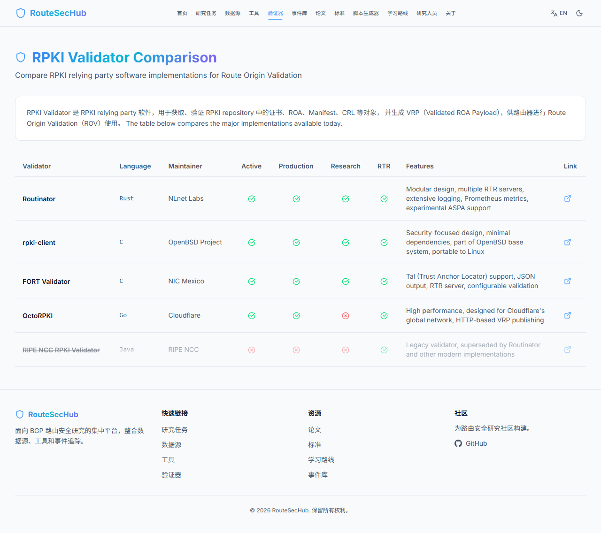
  <br/>
  <em>Routinator、rpki-client、FORT Validator、OctoRPKI 对比表</em>
</div>

#### 👥 研究人员
<div align="center">
  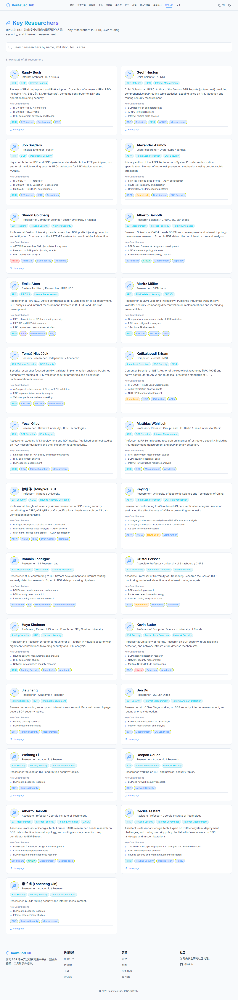
  <br/>
  <em>26 位 RPKI/BGP 路由安全领域关键研究人员档案</em>
</div>

#### 📚 学习路线
<div align="center">
  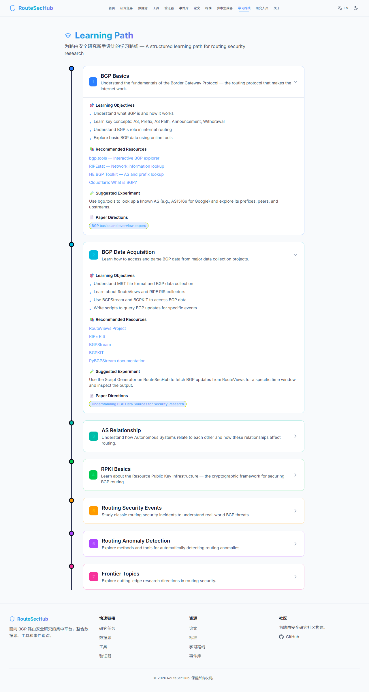
  <br/>
  <em>7 级学习路线，从 BGP 基础到 ASPA/BGPsec 前沿</em>
</div>

#### ℹ️ 关于页面
<div align="center">
  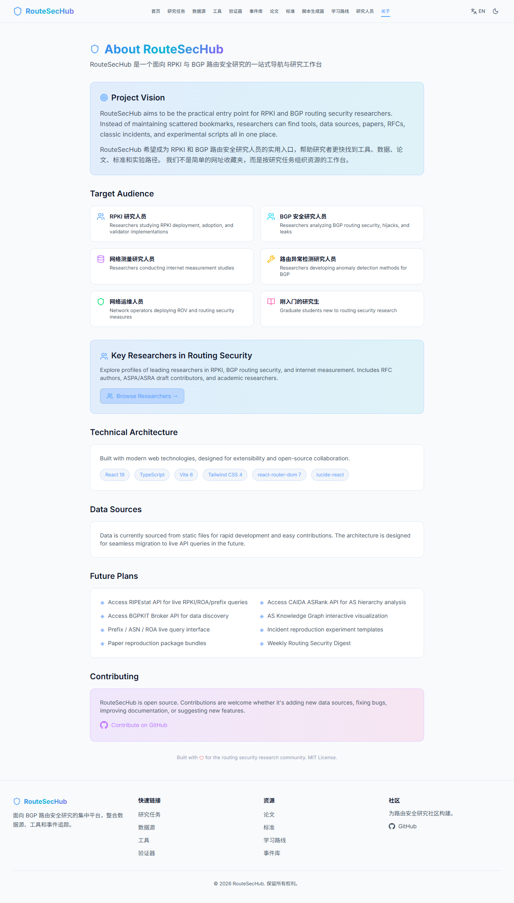
  <br/>
  <em>项目愿景、目标受众、技术架构、后续规划</em>
</div>

---

## 🚀 快速开始

### 环境要求

- **Node.js** >= 18
- **npm** >= 9

### 本地运行

```bash
# 1. 克隆项目
git clone https://github.com/RouteSecHub/RouteSecHub.git
cd RouteSecHub

# 2. 安装依赖
npm install

# 3. 启动开发服务器
npm run dev

# 4. 浏览器打开 http://localhost:5173
```

### 生产构建

```bash
# 构建
npm run build

# 预览构建结果
npm run preview
```

---

## 📁 项目结构

```
src/
├── components/
│   ├── layout/              # 布局组件
│   │   ├── Navbar.tsx       # 导航栏（含主题切换、语言切换）
│   │   └── Footer.tsx       # 页脚
│   ├── common/              # 通用组件
│   │   ├── SearchBar.tsx    # 搜索输入框
│   │   ├── GlobalSearchBar.tsx # 全局搜索（带下拉结果）
│   │   ├── Tag.tsx          # 标签/徽章
│   │   ├── FilterPanel.tsx  # 筛选面板
│   │   ├── StatCard.tsx     # 统计卡片
│   │   ├── CodeBlockWithCopy.tsx # 代码块（带复制按钮）
│   │   └── SectionHeader.tsx # 区域标题
│   └── cards/               # 卡片组件
│       ├── ResourceCard.tsx  # 资源卡片
│       ├── ToolCard.tsx      # 工具卡片
│       ├── DatasetCard.tsx   # 数据集卡片
│       ├── IncidentCard.tsx  # 事件卡片
│       ├── PaperCard.tsx     # 论文卡片
│       └── StandardCard.tsx  # 标准卡片
├── contexts/                # React Context
│   ├── ThemeContext.tsx      # 主题切换（亮/暗）
│   └── I18nContext.tsx       # 国际化（中/英）
├── data/                    # 静态数据（便于后续替换为 API）
│   ├── resources.ts         # 46+ 资源
│   ├── tools.ts             # 22+ 工具
│   ├── datasets.ts          # 19 数据集
│   ├── incidents.ts         # 7 经典事件
│   ├── papers.ts            # 25 论文
│   ├── standards.ts         # 26 RFC/标准
│   ├── learningPath.ts      # 7 级学习路线
│   ├── researchTasks.ts     # 6 研究任务
│   └── researchers.ts       # 26 位研究人员
├── pages/                   # 页面组件（13 个页面）
│   ├── Home.tsx             # 首页
│   ├── ResearchTasks.tsx    # 研究任务
│   ├── Datasets.tsx         # 数据源
│   ├── Tools.tsx            # 工具
│   ├── Validators.tsx       # RPKI Validator 对比
│   ├── Incidents.tsx        # 事件库
│   ├── IncidentDetail.tsx   # 事件详情
│   ├── Papers.tsx           # 论文
│   ├── Standards.tsx        # 标准
│   ├── ScriptGenerator.tsx  # 脚本生成器
│   ├── LearningPath.tsx     # 学习路线
│   ├── Researchers.tsx      # 研究人员
│   └── About.tsx            # 关于
├── types/                   # TypeScript 类型定义
│   └── index.ts
├── utils/                   # 工具函数
│   ├── filters.ts           # 筛选逻辑
│   ├── search.ts            # 全局搜索
│   └── scriptGenerator.ts   # 脚本生成
├── App.tsx                  # 主应用（路由配置）
├── main.tsx                 # 入口文件
└── index.css                # 全局样式（Tailwind CSS v4）
```

---

## 🛠️ 技术栈

| 技术 | 版本 | 用途 |
|:---|:---|:---|
| **React** | 19 | UI 框架 |
| **TypeScript** | 6.0 | 类型安全 |
| **Vite** | 8 | 构建工具 |
| **Tailwind CSS** | 4 | 样式框架 |
| **react-router-dom** | 7 | 客户端路由 |
| **lucide-react** | 1.22 | 图标库 |

---

## 📊 数据来源

RouteSecHub 整合了以下主要数据源：

### BGP 原始数据
- **[RouteViews](https://routeviews.org)** — 俄勒冈大学 BGP 数据收集项目
- **[RIPE RIS](https://ris.ripe.net)** — RIPE NCC 路由信息服务
- **[RIS Live](https://ris-live.ripe.net)** — RIPE RIS 实时 WebSocket 流

### BGP 数据处理
- **[BGPStream](https://bgpstream.caida.org)** — CAIDA BGP 数据分析框架
- **[BGPKIT](https://bgpkit.com)** — 高性能 MRT 解析工具包
- **[PyBGPStream](https://bgpstream.caida.org)** — BGPStream Python 接口

### AS 关系与组织
- **[CAIDA ASRank](https://asrank.caida.org)** — AS 排名系统
- **[CAIDA AS Relationship](https://www.caida.org/catalog/datasets/as-relationships/)** — AS 关系数据
- **[PeeringDB](https://www.peeringdb.com)** — 对等数据库

### RPKI / ROA / VRP
- **[Routinator](https://www.nlnetlabs.nl/projects/rpki/routinator/)** — NLnet Labs RPKI 验证器
- **[RIPEstat](https://stat.ripe.net)** — RIPE NCC 信息系统
- **[NIST RPKI Monitor](https://rpki-monitor.antd.nist.gov)** — RPKI 部署监控

### 路由安全监控
- **[BGPalerter](https://bgpalerter.readthedocs.io)** — 实时 BGP 监控告警
- **[ARTEMIS](https://bgpartemis.org)** — BGP 前缀劫持检测系统
- **[Cloudflare Radar](https://radar.cloudflare.com)** — 互联网智能平台
- **[MANRS](https://www.manrs.org)** — 路由安全最佳实践

### WHOIS 查询
- **[RIPE Database](https://apps.db.ripe.net/db-web-ui/query)** — RIPE Whois
- **[ARIN Whois](https://whois.arin.net)** — ARIN Whois
- **[APNIC Whois](https://wq.apnic.net/static/search.html)** — APNIC Whois
- **[AFRINIC Whois](https://whois-web.afrinic.net)** — AFRINIC Whois
- **[RADb](https://www.radb.net)** — 路由资产数据库

---

## 📖 页面功能一览

| 页面 | 功能 |
|:---|:---|
| 🏠 **首页** | 全局搜索、快速入口、研究任务、精选资源、经典事件、统计 |
| 🎯 **研究任务** | 按任务组织：分析 Hijack、查询 RPKI、下载数据、复现论文 |
| 📊 **数据源** | 46+ 数据源，按类别/标签/API/历史/实时筛选 |
| 🔧 **工具** | 22+ 工具，含评分、适用人群、安装方式 |
| ✅ **Validator** | Routinator/rpki-client/FORT/OctoRPKI 对比表 |
| 🚨 **事件库** | 7 个经典事件，按类型/年份筛选，含时间线和分析步骤 |
| 📄 **论文** | 25 篇论文按 11 个方向组织，支持复现难度筛选 |
| 📋 **标准** | 26+ IETF RFC/标准，按 RPKI/ROA/BGPsec/ASPA 分类 |
| 🧪 **脚本生成器** | 生成 PyBGPStream/BGPKIT/wget 脚本 |
| 📚 **学习路线** | 7 级学习路线，从 BGP 基础到前沿 |
| 👥 **研究人员** | 26 位关键研究人员档案，含研究方向和贡献 |
| ℹ️ **关于** | 项目愿景、技术架构、后续规划 |

---

## 🗺️ 后续规划

- [ ] 接入 RIPEstat API 实时查询 RPKI/ROA/前缀
- [ ] 接入 CAIDA ASRank API 进行 AS 层级分析
- [ ] 接入 BGPKIT Broker API 进行数据发现
- [ ] AS 知识图谱交互式可视化
- [ ] 前缀 / ASN / ROA 实时查询界面
- [ ] 事件复现实验模板
- [ ] 论文复现包
- [ ] 每周路由安全摘要（Weekly Routing Security Digest）
- [ ] 用户认证和书签功能
- [ ] 暗色/亮色主题切换优化

---

## 🤝 贡献指南

欢迎贡献！无论是添加数据源、修复 Bug、改进文档还是建议新功能：

```bash
# 1. Fork 项目
# 2. 创建功能分支
git checkout -b feature/amazing-feature

# 3. 提交更改
git commit -m 'Add some amazing feature'

# 4. 推送到分支
git push origin feature/amazing-feature

# 5. 创建 Pull Request
```

### 如何添加新资源

所有数据都在 `src/data/` 目录下的 TypeScript 文件中，直接编辑即可：

```typescript
// src/data/resources.ts
{
  id: "your-resource",
  name: "Your Resource Name",
  description: "Description of the resource",
  category: "BGP Raw Data",
  tags: ["BGP", "Your Tag"],
  type: "Dataset",
  website: "https://example.com",
  hasApi: true,
  supportsHistoricalData: true,
  supportsRealtimeData: false,
  recommendedFor: ["BGP Analysis", "Research"],
}
```

### 如何添加中文描述

在 `src/contexts/I18nContext.tsx` 的 `descZh` 对象中添加：

```typescript
const descZh: Record<string, string> = {
  "your-resource": "你的资源的中文描述",
};
```

---

## 📜 许可证

[MIT License](LICENSE)

---

<div align="center">
  <p>
    为路由安全研究社区用心构建 ❤️
  </p>
  <p>
    <sub>Built with ❤️ for the routing security research community</sub>
  </p>
</div>
