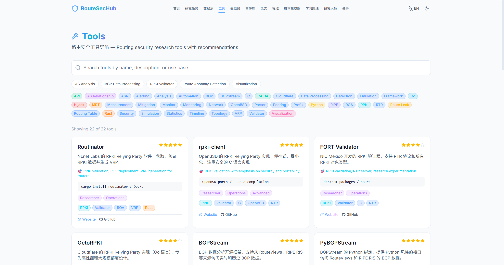
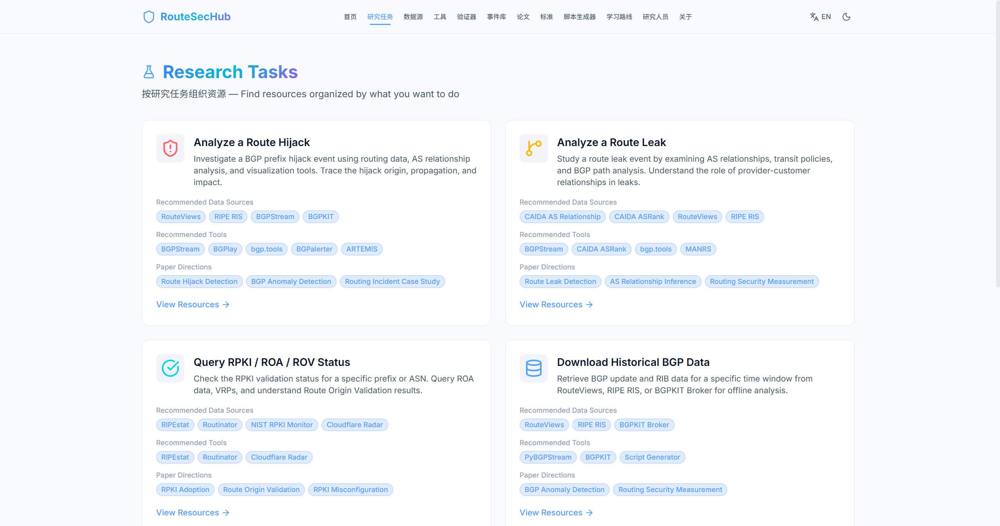
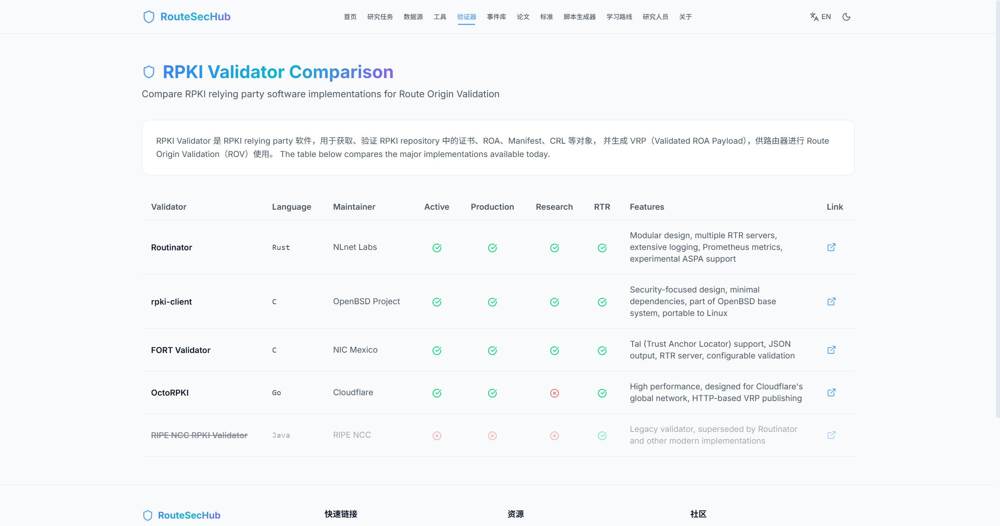
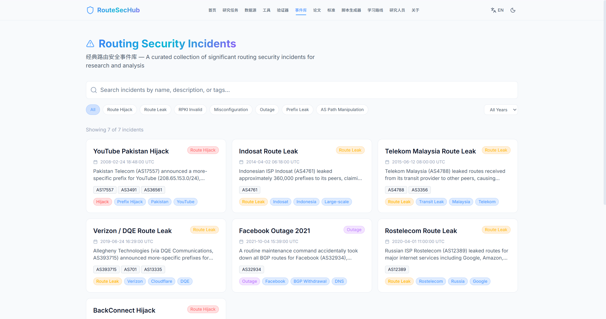
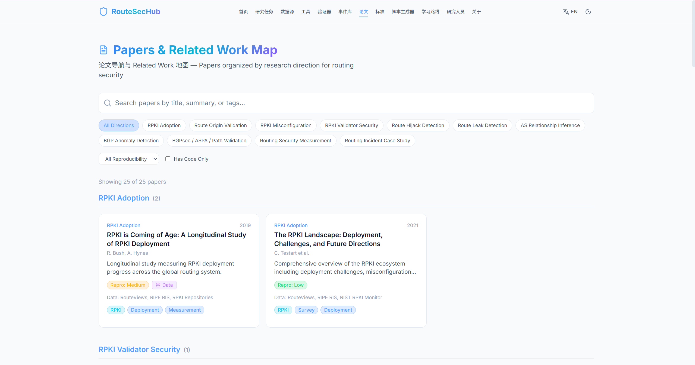
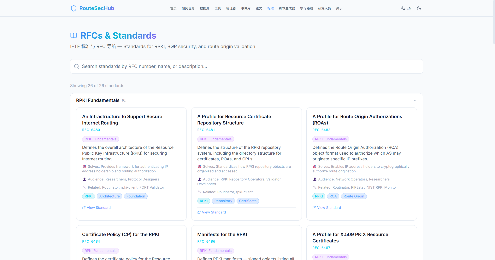
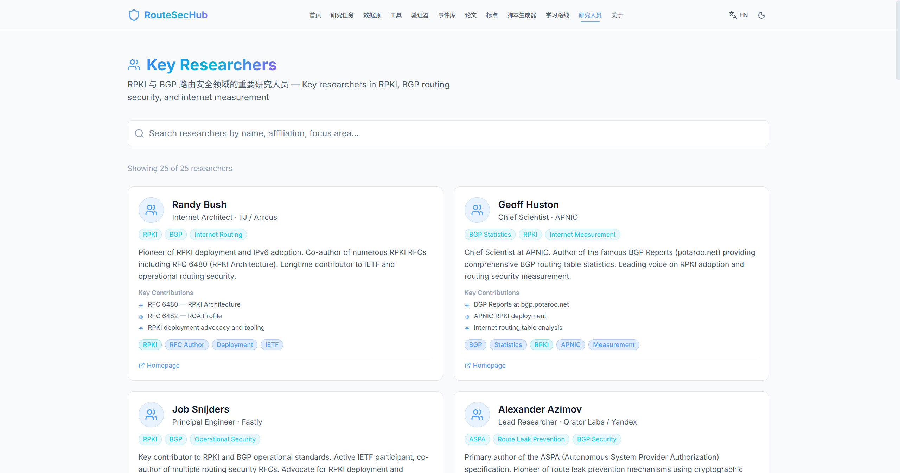

# RouteSecHub

<div align="center">


**RPKI & BGP Routing Security Research Portal**

面向 RPKI 与 BGP 路由安全研究的一站式导航与研究工作台

### 🌐 在线访问：[https://liuweihua123.github.io/RouteSecHub/](https://liuweihua123.github.io/RouteSecHub/)

[](https://github.com/liuweihua123/RouteSecHub/releases)
[](https://liuweihua123.github.io/RouteSecHub/)
[](https://opensource.org/licenses/MIT)
[](https://react.dev/)
[](https://www.typescriptlang.org/)
[](https://vitejs.dev/)
[](https://tailwindcss.com/)
[](https://github.com/liuweihua123/RouteSecHub/stargazers)

</div>

---

## 项目简介

**RouteSecHub** 帮助 RPKI 和 BGP 路由安全研究人员快速找到数据源、工具、论文、标准、经典事件和可复现实验路径。它不是简单的网址收藏夹，而是按**研究任务**组织资源的工作台。

> A practical research portal for RPKI & BGP routing security — 46+ data sources, 22+ tools, 25 papers, 7 classic incidents, and a script generator for event reproduction.

---

## 功能预览

### 首页

全局搜索 · 快速入口 · 研究任务 · 精选资源 · 经典事件


### 数据源导航

46+ 数据源，支持按类别、标签、API、历史数据、实时数据筛选


### 工具导航

22+ 路由安全工具，含评分、适用人群、安装方式



### 研究任务

按任务组织资源：分析 Hijack、查询 RPKI、下载数据、复现论文



### RPKI Validator 对比

Routinator / rpki-client / FORT Validator / OctoRPKI 对比表



### 路由安全事件库

7 个经典事件，含时间线、分析步骤、推荐数据源



### 论文导航

25 篇论文按 11 个研究方向组织的 Related Work 地图



### RFC / 标准导航

26+ IETF 标准，按 RPKI、ROA、ROV、BGPsec、ASPA 等分类



### 研究人员

26 位 RPKI / BGP 路由安全领域关键研究人员档案



---

## 核心特性

| 特性 | 说明 |
|:---|:---|
| 🎯 任务驱动导航 | 按研究任务组织资源，而非堆链接 |
| 📊 46+ 数据源 | RouteViews、RIPE RIS、BGPStream、CAIDA、RIPEstat 等 |
| 🔧 22+ 工具 | RPKI Validator、BGPalerter、ARTEMIS、bgp.tools 等 |
| 📄 25 篇论文 | 按 11 个研究方向组织的 Related Work 地图 |
| 📋 26+ RFC/标准 | RPKI、ROA、ROV、BGPsec、ASPA 等 IETF 标准 |
| 🚨 7 个经典事件 | YouTube Hijack、Facebook Outage 等，含时间线和分析步骤 |
| 🧪 脚本生成器 | 一键生成 PyBGPStream / BGPKIT / wget 脚本 |
| 📚 7 级学习路线 | 从 BGP 基础到 ASPA / BGPsec 前沿 |
| 👥 26 位研究人员 | RFC 作者、ASPA 贡献者、学术界关键人物 |
| 🌐 中英文切换 | 全站支持中文 / 英文切换 |
| ☀️🌙 亮暗主题 | 明亮和暗色两种主题风格 |
| 🔍 全局搜索 | 首页搜索框实时搜索所有资源 |

---

## 快速开始

```bash
# 克隆项目
git clone https://github.com/liuweihua123/RouteSecHub.git
cd RouteSecHub

# 安装依赖
npm install

# 启动开发服务器
npm run dev

# 浏览器打开 http://localhost:5173
```

```bash
# 生产构建
npm run build

# 预览构建结果
npm run preview
```

---

## 技术栈

| 技术 | 版本 | 用途 |
|:---|:---|:---|
| React | 19 | UI 框架 |
| TypeScript | 6.0 | 类型安全 |
| Vite | 8 | 构建工具 |
| Tailwind CSS | 4 | 样式框架 |
| react-router-dom | 7 | 客户端路由 |
| lucide-react | 1.22 | 图标库 |

---

## 项目结构

```
src/
├── components/
│   ├── layout/              # Navbar, Footer
│   ├── common/              # SearchBar, GlobalSearchBar, Tag, FilterPanel,
│   │                          StatCard, CodeBlockWithCopy, SectionHeader
│   └── cards/               # ResourceCard, ToolCard, DatasetCard,
│                              IncidentCard, PaperCard, StandardCard
├── contexts/
│   ├── ThemeContext.tsx      # 亮/暗主题切换
│   └── I18nContext.tsx       # 中/英文国际化
├── data/
│   ├── resources.ts         # 46+ 资源
│   ├── tools.ts             # 22+ 工具
│   ├── datasets.ts          # 19 数据集
│   ├── incidents.ts         # 7 经典事件
│   ├── papers.ts            # 25 论文
│   ├── standards.ts         # 26 RFC/标准
│   ├── learningPath.ts      # 7 级学习路线
│   ├── researchTasks.ts     # 6 研究任务
│   └── researchers.ts       # 26 位研究人员
├── pages/                   # 13 个页面
├── types/                   # TypeScript 类型定义
├── utils/                   # filters, search, scriptGenerator
├── App.tsx                  # 路由配置
├── main.tsx                 # 入口
└── index.css                # 全局样式
```

---

## 数据来源

**BGP 原始数据：** [RouteViews](https://routeviews.org) · [RIPE RIS](https://ris.ripe.net) · [RIS Live](https://ris-live.ripe.net)

**BGP 数据处理：** [BGPStream](https://bgpstream.caida.org) · [BGPKIT](https://bgpkit.com) · [PyBGPStream](https://bgpstream.caida.org)

**AS 关系：** [CAIDA ASRank](https://asrank.caida.org) · [CAIDA AS Relationship](https://www.caida.org/catalog/datasets/as-relationships/) · [PeeringDB](https://www.peeringdb.com)

**RPKI / ROA：** [Routinator](https://www.nlnetlabs.nl/projects/rpki/routinator/) · [RIPEstat](https://stat.ripe.net) · [NIST RPKI Monitor](https://rpki-monitor.antd.nist.gov)

**路由安全：** [BGPalerter](https://bgpalerter.readthedocs.io) · [ARTEMIS](https://bgpartemis.org) · [Cloudflare Radar](https://radar.cloudflare.com) · [MANRS](https://www.manrs.org)

**WHOIS：** [RIPE](https://apps.db.ripe.net/db-web-ui/query) · [ARIN](https://whois.arin.net) · [APNIC](https://wq.apnic.net/static/search.html) · [AFRINIC](https://whois-web.afrinic.net) · [RADb](https://www.radb.net)

---

## 后续规划

- [ ] 接入 RIPEstat API 实时查询 RPKI / ROA / 前缀
- [ ] 接入 CAIDA ASRank API 进行 AS 层级分析
- [ ] 接入 BGPKIT Broker API 进行数据发现
- [ ] AS 知识图谱交互式可视化
- [ ] 前缀 / ASN / ROA 实时查询界面
- [ ] 事件复现实验模板
- [ ] 论文复现包
- [ ] 每周路由安全摘要

---

## 贡献

欢迎贡献！Fork → Branch → Commit → PR。

```bash
# 添加新资源：编辑 src/data/resources.ts
# 添加中文描述：编辑 src/contexts/I18nContext.tsx 的 descZh 对象
```

---

## 许可证

[MIT License](LICENSE)

---

<div align="center">
  为路由安全研究社区用心构建 ❤️
</div>
